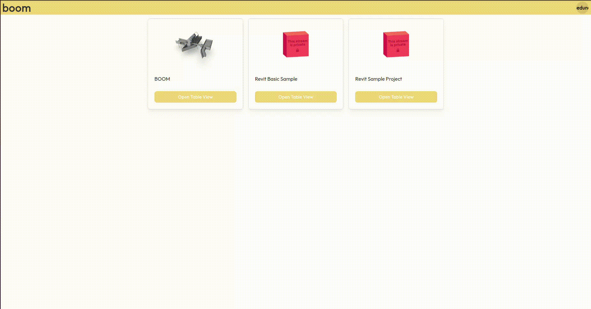

# BOOM Speckle
Bill Of Open Materials - A quantity take-off app for Speckle



Quantity take-offs is a intermediate step between your BIM model and analyses like LCA and cost calculations.\
Instead of doing your schedules in Revit, you can use boom to create quantity take-offs directly from Speckle.

## Getting Started

### Prerequisites

- [Node.js](https://nodejs.org/en/) (version 18 or higher)

### Installation

To get started, clone this repository and install the dependencies:

```bash
git clone https://github.com/ocni-dtu/boom-speckle.git
cd boom-speckle
npm install
```

### Configuration

The application requires a Speckle Server to be running and a [Speckle Application](https://speckle.guide/dev/apps.html)
to be configured on the server. The application will use the `http://localhost:8000` URL by default, so make sure to
configure the application with this URL.

This template uses the main [Speckle Server](https://speckle.xyz) by default. To use a different server, you can change
the `VITE_APP_SERVER_URL` environment variable in the `.env` file.

To use your own Application, you can change the `VITE_APP_APP_ID` and `VITE_APP_APP_SECRET` environment variables in
the `.env` file. You will have to configure the Speckle Application redirect URL to `http(s)://<your-app-url>/auth`.

## Application Structure

The application is structured as follows:

- `src/components` - contains the React UI components.
- `src/contexts` - contains React Context objects used to share authentication across the application
- `src/pages` - contains pages for the app
- `src/queries` - contains GraphQL queries/mutations, together with autogenerated hooks to interact with Speckle's API
- `src/main.tsx` - the application entrypoint

## Available Scripts

In the project directory, you can run:

### `npm dev`

Runs the app in the development mode.\
Open [http://localhost:8000](http://localhost:8000) to view it in the browser.

The page will reload if you make edits.

### `npm codegen`

Generate hooks from `src/queries/queries.graphql` to use in the app

### `npm build`

Builds the app for production to the `dist` folder.\

The build is minified and the filenames include the hashes.\
Your app is ready to be deployed!

